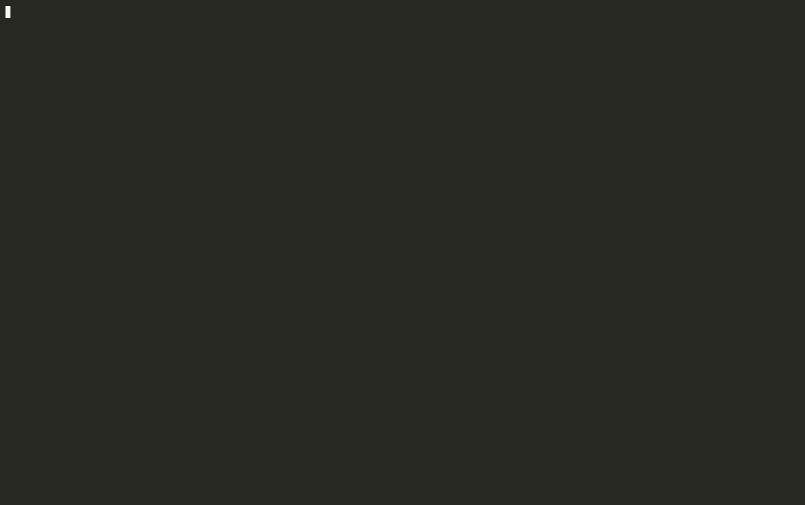

# NGINX Rift

RCE Proof of concept for **CVE-2026-42945**, a critical heap buffer overflow in NGINX's `ngx_http_rewrite_module` introduced in 2008. The bug enables unauthenticated remote code execution against servers using `rewrite` and `set` directives.

This vulnerability — along with three other memory corruption issues (CVE-2026-42946, CVE-2026-40701, CVE-2026-42934) — was autonomously discovered by [depthfirst](https://depthfirst.com)'s security analysis system after a single click of onboarding the NGINX source.

> Want to find issues like this in your own code? Try the same system at **<https://depthfirst.com/open-defense>**.

## The Bug (TL;DR)

NGINX's script engine uses a two-pass process: first compute the required buffer size, then copy data in. The `is_args` flag is set on the main engine when a `rewrite` replacement contains `?`, but the length-calculation pass runs on a freshly zeroed sub-engine. So:

- **Length pass** sees `is_args = 0` → returns raw capture length.
- **Copy pass** sees `is_args = 1` → calls `ngx_escape_uri` with `NGX_ESCAPE_ARGS`, expanding each escapable byte to 3 bytes.

The copy overflows the undersized heap buffer with attacker-controlled URI data. Exploitation uses cross-request heap feng shui to corrupt an adjacent `ngx_pool_t`'s `cleanup` pointer (sprayed via POST bodies, since URI bytes can't contain null bytes), redirecting it to a fake `ngx_pool_cleanup_s` invoking `system()` on pool destruction.

Read more about this bug in our [technical write-up](https://depthfirst.com/research/nginx-rift-achieving-nginx-rce-via-an-18-year-old-vulnerability).

## Affected & Fixed Versions

| Product | Affected | Fixed in |
| --- | --- | --- |
| NGINX Open Source | 0.6.27 – 1.30.0 | 1.31.0, 1.30.1 |
| NGINX Plus | R32 – R36 | R36 P4, R35 P2, R32 P6 |

Full vendor advisory: <https://my.f5.com/manage/s/article/K000160932>

## Private Research Fork: ASLR-Enabled Remote Lab Chain




This fork keeps the original disclosure PoC intact, but adds a second research track focused on a more realistic question:

> Can the bug be exploited against a real x86_64 Linux VM with ASLR enabled, without relying on hardcoded Docker/lab offsets?

The answer in this research fork is **yes, with important constraints**. The working chains do not disable ASLR and do not use the original hardcoded heap/libc addresses. Instead, they derive runtime state through same-port HTTP-accessible primitives, then select the final heap target from remotely obtained disclosure data.

There are now two working ASLR-enabled tracks:

- `nginx_rifter.py`: the clean, self-contained assessment and integrated exploit entry point. It models an authorized tester evaluating a vulnerable nginx deployment with an HTTP-accessible local-file-read primitive. The integrated exploit path is the VM-tested, core-guided chain.
- `tools/proc_mem_coreless_exploit.py`: the newer coreless research proof. It replaces the readable crash-core requirement with a same-UID read of `/proc/<nginx-worker>/mem` through the file-read primitive, then scans live worker memory for usable fake-cleanup slots.

The target topology is intentionally same-port:

- vulnerable route: `/api/...`
- PHP local-file-read route: `/lfi.php?file=...`
- phpinfo hint route: `/phpinfo.php`
- HTTP/2 victim connection: same nginx listener and worker
- proof verification: marker file read back through the PHP LFI endpoint

The core-guided path performs the following high-level steps:

1. Uses PHP LFI to read PHP identity, nginx pid files, nginx worker `/proc/<pid>/maps`, and the mapped libc file.
2. Parses the target libc over LFI to compute the absolute `system()` address for that worker.
3. Uses a URI-safe probe overwrite to generate an nginx worker core file.
4. Reads the core file through LFI and locates sprayed fake-cleanup slots.
5. Uses an HTTP/2 connection-pool cleanup record as the partial-overwrite target.
6. Filters candidate fake structures to the same preserved high-byte window as the corrupted cleanup pointer.
7. Retries once with a two-byte cleanup-pointer partial overwrite and verifies command execution through LFI.

The coreless proc-mem path performs the same remote base-address recovery, but avoids crash cores:

1. Uses LFI to identify nginx worker PIDs and read same-UID worker `/proc/<pid>/maps`.
2. Reads the mapped libc ELF through LFI and computes the live `system()` address.
3. Sends the normal NGINX Rift spray/probe traffic while keeping the worker state live.
4. Reads mapped ranges from `/proc/<worker>/mem` through the file-read primitive.
5. Scans live memory for nonce-marked fake-cleanup structures.
6. Uses bounded final candidates derived from live worker memory, not hardcoded lab offsets.

This is not the same as the original deterministic Docker demo. The x86_64 VM path leaves normal Linux ASLR enabled and recomputes process-specific addresses on each run. The Docker coreless path also leaves ASLR enabled and removes the unusual readable-core requirement, but it depends on procfs permission behavior that must be verified for the target class.

### Scope And Caveats

This fork is a controlled research lab. The ASLR-enabled chains rely on strong conditions that are not universal production assumptions:

- PHP must expose a useful local-file-read primitive.
- For the core-guided path, PHP must be able to read same-UID nginx worker `/proc/<pid>/maps`, mapped libc, and the generated worker core.
- For the coreless proc-mem path, PHP must be able to read same-UID nginx worker `/proc/<pid>/maps`, mapped libc, and `/proc/<pid>/mem` at large mapped offsets.
- HTTP/2 is enabled on the same nginx listener to provide the connection-pool cleanup target used by the final chain.

`phpinfo()` and `/proc/<pid>/maps` are enough to recover PIE/libc base addresses, but they are not enough by themselves to recover the exact heap object/window needed for this exploit. The older chain used a readable crash core for that final disclosure. The newer Docker proof uses `/proc/<worker>/mem` instead, which is closer to a real arbitrary-file-read consequence in same-UID deployments because it exposes live worker memory without changing core-dump policy.

Important remaining limits:

- `/proc/<pid>/mem` is ptrace-gated. It worked in the Docker lab and in a same-UID check against the official `nginx:stable` image model, but different-UID app processes should fail under default procfs protections.
- The file-read primitive must support large offsets or an equivalent range API.
- A real Ubuntu VM retest for the proc-mem path is still pending.
- A direct non-LFI nginx response memory leak has not been found. Passive reflection, redirect/header/body probes, an initial delayed-proxy over-read sweep, and an SSRF-assisted source review have not produced ASLR-relevant disclosure.

### Current Tooling

The current clean entry point is `nginx_rifter.py`, an assessment-first tool intended to be closer to how an authorized tester would evaluate a known vulnerable nginx deployment with an HTTP-accessible local-file-read primitive.

Compared with the initial demo runner, `nginx_rifter.py` improves the workflow in several ways:

- Assessment is the default. It does not run the crashing exploit unless `--exploit` is explicitly supplied.
- The target is provided as `HOST:PORT`, and the file-read primitive is modular through `--file-read-template`.
- It profiles the LFI primitive before relying on it, including text reads, binary reads, ranged reads, `/proc/self/status`, and `/proc/self/maps`.
- It discovers nginx worker maps, libc, `system()`, build IDs, binary hashes, OS details, and kernel/core settings through the remote primitive.
- It attempts nginx config discovery from master cmdline and common config paths, then flags vulnerable `rewrite` + `set` route candidates.
- It prints an exploit-chain viability matrix so missing prerequisites are visible before any exploit attempt.
- Exploit mode is explicit and integrated into `nginx_rifter.py`.

The current `nginx_rifter.py` is self-contained. It no longer imports or shells out to earlier demo PoC versions for assessment or exploitation.

The newest coreless work currently lives in `tools/proc_mem_coreless_exploit.py`. It is intentionally separate while the proc-mem chain is still being validated. It uses the same modular HTTP file-read concept and explicit `--file-read-template`, but it is not yet folded into the all-in-one `nginx_rifter.py` interface.

The newer `demo4.gif` shows the `nginx_rifter.py` assessment and explicit exploit flow. `artifacts/coreless_proc_mem_explicit_fileread_20260518.gif` shows the coreless proc-mem proof using an explicit file-read primitive. The earlier `nginx-aslr-demo.gif` remains as the original ASLR-enabled exploit demo.

## Usage

Tested on Ubuntu 24.04.3 LTS.

Original ASLR-disabled Docker reproduction:

1. `./setup.sh` — build the container.
2. `docker compose -f env/docker-compose.yml up` — start the vulnerable NGINX server.
3. `python3 poc.py --shell` — pop a shell.

For the local Docker reproduction flow, see [LAB.md](LAB.md).

ASLR-enabled VM research chain:

```bash
./ctf_remote_exploit.py --host <target-host> --port 19321 \
  --core-guided --target-len 2 --h2-victim \
  --a-count 127 --plus-count 962 \
  --tries-per-candidate 1 --max-core-hits 100
```

Assessment-first v2 tool:

```bash
./nginx_rifter.py --target <target-host>:19321
```

`nginx_rifter.py` is the current real-world-oriented assessor and integrated PoC entry point. Its default mode does not run the crashing exploit path. It profiles the HTTP file-read primitive, checks ranged and binary reads, fingerprints OS/nginx/libc, discovers nginx workers and ASLR-relevant maps, tries to recover nginx config paths through pid/cmdline/config reads, flags vulnerable `rewrite` + `set` route candidates, and prints a viability matrix for the current core-guided chain.

The current `nginx_rifter.py` is self-contained. It no longer imports or shells out to earlier demo PoC versions for assessment or exploitation.

For a custom LFI/download shape:

```bash
./nginx_rifter.py --target <target-host>:19321 \
  --file-read-template 'http://{host}:{port}/download?path={path_url}{range_query}'
```

Exploit execution is explicit:

```bash
./nginx_rifter.py --target <target-host>:19321 --exploit --cmd id --fast

# Discovery-only exploit smoke test, no crash probes
./nginx_rifter.py --target <target-host>:19321 --exploit --derive-only --cmd id
```

Coreless proc-mem research proof:

```bash
python3 -u tools/proc_mem_coreless_exploit.py \
  --target <target-host>:19321 \
  --file-read-template 'http://{host}:{port}/lfi.php?file={path_url}{range_query}' \
  --phpinfo-path '' \
  --cmd id \
  --target-len 6 \
  --max-region 268435456 \
  --max-final-candidates 5
```

This path avoids readable crash cores, but still requires same-UID procfs access to `/proc/<nginx-worker>/mem` and a file-read primitive capable of reading large mapped offsets.

Recording-friendly terminal demo:

```bash
./demo_ctf_exploit_v1_9.py --host <target-host>:19321 --cmd id --clear
```

`demo_ctf_exploit_v1_9.py` is the current operator-facing runner. By default it uses the best-tested lab path, keeps console output to key stages and evidence, prints detailed target fingerprints, and leaves captured command output as the final terminal block. Pass `-v` for probe/candidate-level trace output. The final command output is printed as plain terminal text, without borders or per-line prefixes.

The default file-read primitive is this fork's PHP route:

```text
/lfi.php?file=<path>&offset=<n>&length=<n>
```

For a different known-vulnerable CTF app or testing platform, the file-read vector is modular:

```bash
./demo_ctf_exploit_v1_9.py --host <target-host>:19321 --cmd id \
  --target-profile generic \
  --file-read-template 'http://{host}:{port}/download?path={path_url}{range_query}'
```

The template supports `{host}`, `{port}`, `{path_url}`, `{offset}`, `{length}`, and `{range_query}`. The generic profile skips this fork's lab-specific nginx config assertions, but the exploit still needs the same underlying capabilities: readable nginx worker `/proc` maps, readable libc, and either a readable crash core for the core-guided path or readable `/proc/<worker>/mem` for the coreless path. `phpinfo()` is optional; use `--phpinfo-path ''` to disable it.

Realism caveat: the LFI/file-read bug class and same-host nginx/PHP-FPM deployment model are realistic. The proc-mem chain is more realistic than the earlier crash-core chain because it does not require enabling or reading worker core dumps. It is still not a universal default-production assumption: same-UID process layout, procfs/Yama policy, container namespace settings, and the quality of the file-read primitive decide whether `/proc/<worker>/mem` is reachable.

No-LFI research probes:

```bash
python3 tools/non_lfi_leak_probe.py --target <target-host>:19321
python3 tools/non_lfi_active_response_probe.py --target <target-host>:19321
```

These are negative research probes, not exploit entry points. They exercise passive reflected sinks and an initial delayed-response over-read shape without using LFI, phpinfo, procfs, cores, debugger access, or hardcoded live ASLR bases.

Additional lab notes and run logs are under `docs/`, especially:

- `docs/CTF_PLAN.md`
- `docs/CTF_FINDINGS.md`
- `docs/CTF_TESTS.md`
- `docs/CTF_EXPERIMENT_LOG.md`
- `docs/DEMO_POC_IMPROVEMENTS.md`
- `docs/KNOWN_LAYOUT_PATTERNS.md`
- `docs/VAGRANT_ESXI.md`
- `docs/CORELESS_ASLR_PLAN.md`
- `docs/CORELESS_ASLR_FINDINGS.md`
- `docs/NON_LFI_ASLR_BYPASS_LOG.md`
- `docs/DEMO_RECORDING_WORKFLOW.md`
